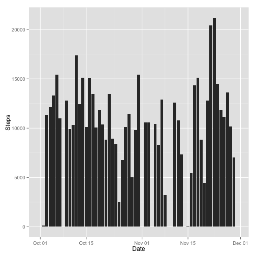
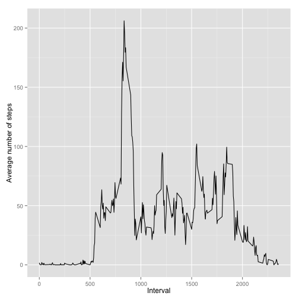
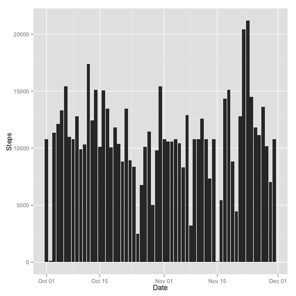
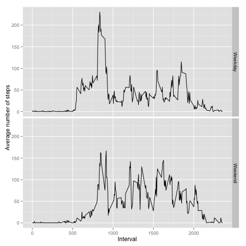

# Reproducible Research: Peer Assessment 1


## Loading and preprocessing the data
First, we import all the packages we will be needing. Here we will only need to
import the `ggplot2` package for drawing all our plots.

```r
library(ggplot2);
```

Now, we load the activity data and convert values in the "date" column to 
*Date* objects for convenient manipulation and plotting.

```r
data <- read.csv('activity.csv');
data[,"date"] <- as.Date(data[,"date"], "%Y-%m-%d");
```


## What is mean total number of steps taken per day?
First, we retrieve the unique dates and sum the steps for each date (while
ignoring missing values).
Then, we plot a histogram of the total number of steps taken each day using the
computed data.


```r
# Get unique dates
dates <- unique(data[,'date']);

# Sum steps for each date
steps <- rep(0, length(dates));
for (d in 0:length(dates)) {
    filter <- data[,'date'] == dates[d];
    steps[d] = sum(data[filter,'steps'], na.rm=TRUE);
}
```

We now plot the histogram of the total number of steps taken each day.

```r
qplot(dates, steps,
      geom="histogram",
      stat="identity",
      xlab="Date",
      ylab="Steps");
```

 

Additionally, we can compute the mean and median total number of steps taken per
day using the previously computed data. Specifically, will use the `summary`
function to do so.

```r
s <- summary(steps);
cat(c("Mean =", as.character(s['Mean'])), "   ",
    c("Median =", as.character(s['Median'])));
```

```
## Mean = 9350     Median = 10400
```

## What is the average daily activity pattern?

Here we make a time series plot of the 5-minute interval and the average number
of steps taken, averaged across all days.

```r
# Get unique intervals
intervals <- unique(data[,'interval']);

# Get average daily steps for each interval
avg_daily_int_steps <- rep(0, length(intervals));
for (i in 0:length(intervals)) {
    filter <- data[,'interval'] == intervals[i];
    avg_daily_int_steps[i] <- mean(data[filter,'steps'], na.rm= TRUE);
}

# Plot average daily steps for each interval as a time-series
qplot(intervals, avg_daily_int_steps,
      geom="line",
      stat="identity",
      xlab="Interval",
      ylab="Average number of steps");
```

 

We can find the index of the interval containing the maximum number of steps
on average by using the `which.max` function.

```r
max_ndx <- which.max(avg_daily_int_steps);
cat("Maximum number of steps on average occurs at 5-min interval starting at ",
    as.character(intervals[max_ndx]),
    "\nwith an average number of steps equal to ",
    as.character(avg_daily_int_steps[max_ndx]), 
    '.', sep="");
```

```
## Maximum number of steps on average occurs at 5-min interval starting at 835
## with an average number of steps equal to 206.169811320755.
```

This result is consistant with the previous plot.

## Imputing missing values

We first compute the number of missing values in the data.

```r
missing_data <- is.na(data[,'steps']);
num_missing <- sum(missing_data);
cat("Number of missing values is ", as.character(num_missing), ".", sep="");
```

```
## Number of missing values is 2304.
```

The strategy we chose to fill in the missing values is to use, for each missing
value, the mean value of steps for their respective 5-minute intervals. We use
these values to create a new data set called `data_fixed`.

```r
# Create a copy of the data
data_fixed <- data[,];

# Iterate through each interval and set the missing data values to the mean
# number of steps of that interval.
for (i in 1:length(intervals)) {
    filter <- (data[,'interval'] == intervals[i]) & missing_data;
    data_fixed[filter, 'steps'] <- avg_daily_int_steps[i];
}
```

We now plot the histogram of the total number of steps taken each day for this
new data set.

```r
steps_fixed <- rep(0, length(dates));
for (d in 0:length(dates)) {
    filter <- data_fixed[,'date'] == dates[d];
    steps_fixed[d] = sum(data_fixed[filter,'steps'], na.rm=TRUE);
}

qplot(dates, steps_fixed,
      geom="histogram",
      stat="identity",
      xlab="Date",
      ylab="Steps");
```

 

We also compute the mean and median total number of steps taken per
day using the new data.

```r
s <- summary(steps_fixed);
cat(c("Mean =", as.character(s['Mean'])), "   ",
    c("Median =", as.character(s['Median'])));
```

```
## Mean = 10800     Median = 10800
```

## Are there differences in activity patterns between weekdays and weekends?
We want to see if there are observable differences in activity during weekdays
and weekends. First, we need to split the data into the two groups. We will
just create a vector of factors identifying each data point as either 'Weekend'
or 'Weekday'. It is assumed that Saturday and Sundays are weekends and all
other days are weekends.

```r
day_of_week <- weekdays(data_fixed[,'date']);
day_type <- sapply(day_of_week,
                   function(x){
                       if (x == 'Sunday' || x == 'Saturday'){
                           return('Weekend');
                       }
                       'Weekday';
                   });
```

We now make a panel plot containing a time series plot of the 5-minute interval
and the average number of steps taken, averaged across all weekday days or
weekend days.

```r
# Compute new average daily steps for each interval for both weekdays and
# weekends.
avg_daily_int_steps_weekend <- rep(0, length(intervals));
avg_daily_int_steps_weekday <- rep(0, length(intervals));
for (i in 0:length(intervals)) {
    filter_weekend <- (data_fixed[,'interval'] == intervals[i]) & 
                      day_type == "Weekend";
    filter_weekday <- (data_fixed[,'interval'] == intervals[i]) & 
                      day_type == "Weekday";
    avg_daily_int_steps_weekend[i] <- mean(data_fixed[filter_weekend,'steps'],
                                           na.rm= TRUE);
    avg_daily_int_steps_weekday[i] <- mean(data_fixed[filter_weekday,'steps'],
                                           na.rm= TRUE);
}

# Create a new dataframe combining the newly computed average daily steps per
# interval labeling them as weekdays or weekends. This will be used as input
# to qplot in order to create a plot faceted by day type.
combined_avg_daily_int <- data.frame(c(intervals, intervals),
                                     c(avg_daily_int_steps_weekend,
                                       avg_daily_int_steps_weekday),
                                     c(rep("Weekend", length(intervals)),
                                       rep("Weekday", length(intervals)))
                                     );
colnames(combined_avg_daily_int) <- c("interval",
                                      "avg_daily_steps",
                                      "day_type");

# Use data frame to create plot
qplot(interval, avg_daily_steps,
      data=combined_avg_daily_int,
      facets=day_type~.,
      geom="line",
      stat="identity",
      xlab="Interval",
      ylab="Average number of steps");
```

 
